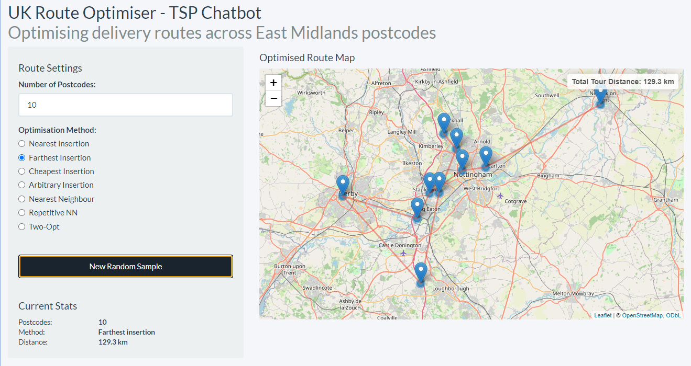
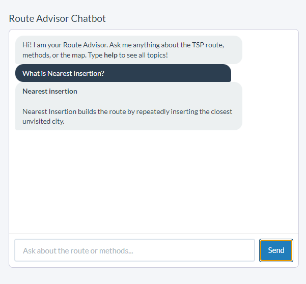

# 🗺️ UK Route Optimiser — Travelling Salesman Problem Chatbot
### *R + Shiny | Combinatorial Optimisation | Interactive Mapping | AI Chatbot*

[](https://www.r-project.org/)
[](https://shiny.posit.co/)
[](https://rstudio.github.io/leaflet/)
[](https://cran.r-project.org/package=TSP)
[](https://opensource.org/licenses/GPL3)

---

## 📋 Table of Contents
- [Problem Statement](#-problem-statement)
- [Solution](#-solution)
- [Demo](#-demo)
- [Tech Stack](#-tech-stack)
- [Key Features](#-key-features)
- [How It Works](#-how-it-works)
- [TSP Algorithms Explained](#-tsp-algorithms-explained)
- [Chatbot Capabilities](#-chatbot-capabilities)
- [Project Structure](#-project-structure)
- [How to Run](#-how-to-run)
- [Dataset](#-dataset)
- [Author](#-author)

---

## 🚨 Problem Statement

Logistics and delivery companies operating across the **East Midlands, UK** face a critical daily challenge: planning the most efficient route across multiple delivery stops. Manual route planning is:

- ⏱️ **Time-consuming** — staff spend hours mapping routes by hand
- 💷 **Costly** — suboptimal routes increase fuel consumption and driver hours
- ❌ **Error-prone** — human planners rarely find the shortest possible route
- 📦 **Unscalable** — as stop counts grow, manual planning becomes impractical

The **Travelling Salesman Problem (TSP)** is the mathematical formalisation of this challenge: *"Given N locations, find the shortest possible route that visits each location exactly once and returns to the origin."* This is classified as **NP-hard**, meaning no algorithm can solve it perfectly for large inputs in reasonable time — making smart heuristics essential.

---

## 💡 Solution

This app is an **interactive R Shiny chatbot** that:

1. Randomly samples delivery postcodes from 100 real East Midlands locations
2. Computes geographic distances using the **Haversine formula** (accounts for Earth's curvature)
3. Applies one of **7 TSP heuristic algorithms** to find an optimised tour
4. Renders the route on a **live Leaflet map** with total distance in km
5. Provides a **conversational chatbot** that explains every algorithm, interprets results, and gives recommendations

The chatbot makes the technical complexity of TSP accessible — users can ask plain-English questions and get instant, intelligent answers about their route and the methods used.

---

## 🎬 Demo

> **Add your screenshots here after running the app**

| Map View | Chatbot Interaction |
|----------|---------------------|
|  |  |

> 📸 *Take screenshots of the interactive map and chatbot panel, save them in a `screenshots/` folder, then update the paths above.*

**Suggested screenshots to take:**
- Full app with a 15-postcode route rendered on the map
- Chatbot explaining the Two-Opt algorithm
- Stats panel showing distance and method
- A comparison of routes using different methods

---

## 🛠️ Tech Stack

| Component | Technology | Purpose |
|-----------|-----------|---------|
| App Framework | R Shiny | Web application engine |
| UI Theme | shinythemes (Flatly) | Clean, responsive Bootstrap styling |
| Interactive Map | leaflet | Real-time route visualisation on OpenStreetMap |
| TSP Solver | TSP (Hahsler) | 7 heuristic optimisation algorithms |
| Distance Calculation | Custom Haversine | Great-circle geographic distances |
| Chatbot Engine | Base R (reactive) | Rule-based conversational interface |
| Data | Book1.csv | 100 East Midlands postcodes with lat/long |

---

## ✨ Key Features

### 🗺️ Route Optimisation
- **7 TSP algorithms** selectable in real time: Nearest Insertion, Farthest Insertion, Cheapest Insertion, Arbitrary Insertion, Nearest Neighbour, Repetitive Nearest Neighbour, Two-Opt
- **Live Leaflet map** showing optimised route as a polyline across all selected postcodes
- **Real-time distance calculation** in kilometres using Haversine great-circle formula
- **Random postcode sampling** — click "New Random Sample" to instantly test a new set of locations
- **Configurable stop count** — from 2 to 100 postcodes

### 💬 Chatbot Advisor
- Greets users and explains the app purpose
- Answers questions about **current route distance and method**
- Explains all **7 TSP algorithms** on demand (e.g. *"explain two opt"*)
- Gives **method recommendations** based on speed vs quality needs
- Explains the **TSP problem** and **Haversine formula** in plain English
- Provides **postcode count advice** for different use cases
- Context-aware — knows the current settings and result at all times

### 📊 Stats Panel
- Live display of: number of postcodes, active method, and total tour distance
- Updates automatically when settings change

---

## ⚙️ How It Works

```
User selects N postcodes and TSP method
         ↓
App randomly samples N rows from Book1.csv (100 East Midlands postcodes)
         ↓
Haversine distance matrix computed for all N×N pairs
         ↓
TSP object created from distance matrix
         ↓
solve_TSP() applies selected heuristic algorithm
         ↓
Ordered tour returned → tour_length() computes total km
         ↓
Leaflet map renders: markers + polyline route
         ↓
Stats panel and chatbot update with current results
```

### Haversine Distance Formula
The app uses the **Haversine formula** to compute accurate geodesic distances between postcode coordinates:

```
a = sin²(Δlat/2) + cos(lat1) × cos(lat2) × sin²(Δlon/2)
d = 2R × arctan2(√a, √(1−a))     where R = 6371 km
```

This is significantly more accurate than Euclidean distance for geographic routing at the scale of the East Midlands (~100km across).

---

## 🧮 TSP Algorithms Explained

| Algorithm | Strategy | Speed | Quality |
|-----------|----------|-------|---------|
| **Nearest Insertion** | Always insert the closest unvisited city | Fast | Good |
| **Farthest Insertion** | Start with the two furthest; always insert the farthest remaining | Medium | Very Good |
| **Cheapest Insertion** | Insert the city that increases tour length the least | Medium | Very Good |
| **Arbitrary Insertion** | Random city selection, optimal insertion position | Fast | Moderate |
| **Nearest Neighbour** | Greedy — always go to the closest unvisited next | Very Fast | Moderate |
| **Repetitive NN** | Run Nearest Neighbour from every starting city, keep best | Slow | Good |
| **Two-Opt** | Improve existing tour by swapping edge pairs to remove crossings | Medium | Excellent |

> **Recommendation:** Use *Two-Opt* or *Repetitive NN* for best tour quality. Use *Nearest Neighbour* for fastest results on large inputs.

---

## 💬 Chatbot Capabilities

The chatbot understands the following types of questions:

```
"Hello" / "Hi"              → Introduction and topic guide
"help"                      → Full list of capabilities
"What is the distance?"     → Current tour distance in km
"How many postcodes?"       → Current postcode count and tips
"Explain two opt"           → Algorithm explanation
"Which method is best?"     → Personalised recommendations
"What is TSP?"              → NP-hard problem explanation
"How is distance calculated?" → Haversine formula explanation
"Who made this?"            → Author and attribution
```

---

## 📁 Project Structure

```
chatbot-uktsp-route-optimiser/
│
├── app.R                   # Complete Shiny application (UI + Server + Chatbot)
├── Book1.csv               # East Midlands postcode dataset (100 locations)
├── README.md               # This file
└── screenshots/            # App screenshots for README
    ├── map_view.png
    └── chatbot_view.png
```

---

## 🚀 How to Run

### Prerequisites
- R (version 4.0 or higher recommended)
- RStudio (recommended)

### Step 1: Install Required Packages

```r
install.packages(c("shiny", "shinythemes", "leaflet", "TSP"))
```

### Step 2: Clone or Download the Repository

```bash
git clone https://github.com/YourUsername/chatbot-uktsp-route-optimiser.git
cd chatbot-uktsp-route-optimiser
```

Or download the ZIP from the green **Code** button above and unzip it.

### Step 3: Run the App

```r
# In RStudio, open app.R and click "Run App"
# OR run from the R console:
shiny::runApp("app.R")
```

### Step 4: Use the App
1. Set the **number of postcodes** (start with 10–15)
2. Select a **TSP algorithm** from the radio buttons
3. The map updates automatically — see the optimised route
4. Try **"New Random Sample"** to test a different set of locations
5. Ask the chatbot: *"Which method is best?"* or *"What is the distance?"*

---

## 📂 Dataset

**File:** `Book1.csv`

| Column | Description |
|--------|-------------|
| `Post.code` | UK postcode (East Midlands region) |
| `LONG` | Longitude coordinate |
| `LAT` | Latitude coordinate |

- **100 real East Midlands postcodes** covering Nottingham, Derby, Leicester and surrounding areas
- Coordinates sourced from UK postcode geolocation data
- Random subsets sampled on each run for variety

---

## 👤 Author

**Clinton Nakpodia**
📧 Nakpodiaclinton@gmail.com
🔗 [GitHub](https://github.com/nakpodia)
💼 [LinkedIn](https://linkedin.com/in/YourProfile)

---

## 📄 License

This project is licensed under the GPL3 License. See [LICENSE](LICENSE) for details.

---

## 🙏 Acknowledgements

- **TSP R Package** by Michael Hahsler — for the heuristic algorithm implementations
- **Leaflet for R** by RStudio — for the interactive mapping
- **shinythemes** — for the Flatly Bootstrap theme
- Original UKTSP Shiny app concept developed as part of the Clinton Data Science Portfolio
